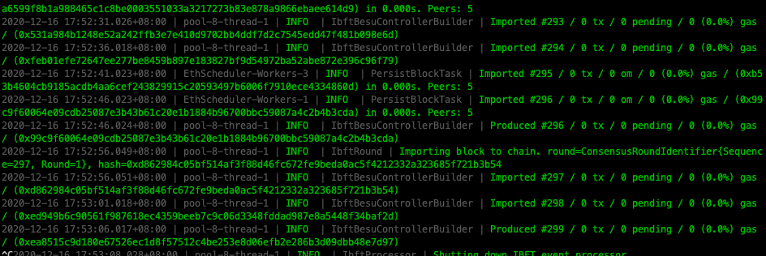

# besu-net-example

### Get binary file
```
wget https://dl.bintray.com/hyperledger-org/besu-repo/besu-20.10.2.zip
unzip besu-20.10.2.zip
```

* openjdk required: v14 above

### Generate Nodes
```
./init.sh
./generate_nodes.sh
```

### Start First Node
```
cd nodes/node1
../../besu-20.10.2/bin/besu --config-file=conf.toml

# then get Enode URL
# for example:
#Enode URL enode://615ae70e4eabe7ced879e865e881a77c8536c8f299fd20662d564e5e1d3200543a533b7bfea3c00f5877e29591df0603b6af3f622d224e81b7af5e26625178f1@127.0.0.1:30303
```

### Update configure files of node2 - node4
* change `bootnodes` settings in conf.toml. fill enode url get of node1.

### Start Others Node
```
cd nodes/node2
../../besu-20.10.2/bin/besu --config-file=conf.toml
cd nodes/node3
../../besu-20.10.2/bin/besu --config-file=conf.toml
cd nodes/node4
../../besu-20.10.2/bin/besu --config-file=conf.toml
```

If blockchain network start work, you will see the console just like below:
